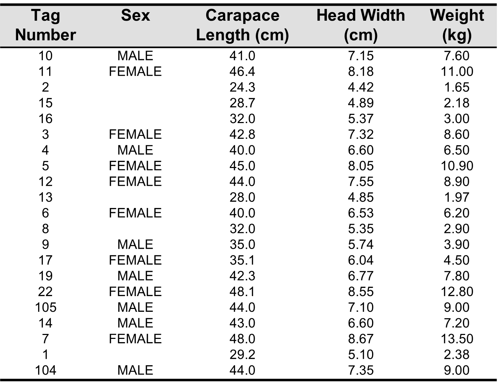

<html lang="en">

```{r setupx, include=FALSE}
knitr::opts_chunk$set(
	echo = TRUE,
	message = FALSE,
	warning = FALSE
)

#necessary to render tutorial correctly
library(learnr) 
library(htmltools)

# for tutorial data (this will be changed to dartR.data)
library(glDemo) 

## Add any additional packages
library("knitr")
opts_knit$set(root.d = rprojroot::find_rstudio_root_file())

```

```{r include=FALSE}
my.data <- caretta
# Add column names
colnames(my.data)=c("id","sex","CL","HW","Wt")
# Make rownames equal to specimen ID
rownames(my.data) <- my.data$id
# Delete column id
my.data$id <- NULL

```

## Welcome
###

To do:

- I need data files from Arthur. Have recreated caretta but genotypes I whipped together randomly.

###

The objective of this tutorial is to introduce you to R programming. The package dartR does not require an indepth knowledge of R programming, so those not wishing to dive deeper into the R programming aspects of SNP data analysis can skip this tutorial.

###

After completing this tutorial you should have a basic understanding of the fundamentals of the R language and programming in R. This includes the means by which to import data into R workflow, understanding of the data structures R uses to hold data, and how to manipulate those data with assignment statements, conditional statements and repetition statements. 

Most importantly, you should be empowered to expand your knowledge beyond the basics presented here by knowing where information on R operations and capabilities are located and how it can be accessed.

###

Throughout this tutorial there will be interactive R scripts/consoles (like the one below). This is like a mini version of R running within this tutorial. But since we are already in R, why not follow along in your own console and start writing your own code in the source panel. You could follow the tutorial exactly or you could follow along using your own data. 

```{r exx, exercise=TRUE}
# Press the Run Code button to run this code
1+1
```

```{r exx-solution}
# This is an example of the interactive component 
#of this tutorial. 

# Try running some code and testing out the three buttons:
#  - Run Code, 
#  - Start Over, 
#  - and Solution

```

###
Some of the exercises within this tutorial are specific to your working environment or Rstudio, these types of exercises will be surrounded by a green box, like the one below.

::: {.my-solution icon="false"}

It might be loading in data, or setting the working environment, or creating an R project. 

They need to be run in your console. These are optional at the time, if you want you can continue with the worked example and come back to these when you want to start working in your own RStudio. 

:::


###

One final note, while going through the tutorial your progress will be saved, if at any point you would like to refresh the tutorial and start over, the <small>[Start Over]{style="color:#a3a3a3; font-family:'Ubuntu';"}</small> button is located at the bottom of the left sidebar, below the tutorial content.

###

Alright let's jump right in!


## Carettochelys survey data
###

```{r datacar}
my.data <- caretta

```

First things first, all the data in this tutorial can be accessed within the tutorial. So, there is no need for you to download it. However, if you do decide you would like to code within your own console, not within this tutorial, a good first step is setting your working directory, so R knows where your files are: 


::: {.my-solution icon="false"}

Set your working directory using the code below, replacing my.directory with the path to the folder you plan to use for this tutorial (i.e., where your data will be loaded from and saved to).

`setwd("my.directory")`

:::

### The data

The data in Table 1 is from a study of the pig-nosed turtle, Carettochelys insculpta. This table contains data from 21 animals caught in Pul Pul Billabong in Kakadu National Park. The sex of each adult turtle was determined based on tail morphology, and the curved carapace length head width and body weight were measured. Note that the sex of four individuals could not be determined and the entry in that column is left blank.

<small>Table 1. Measurements of the pig-nosed turtle, *Carettochelys insculpta*.</small>




### Examine the raw data

Open the file [caretta.dat]{style="color:blue; font-family: 'Courier New';"} [`r xfun::embed_file("./www/caretta.dat", text = "(click to download)")`]{style="font-family: 'Courier New';"} in notepad or your favorite editor and examine its contents. Note that there are a mixture of data types, so these data lend themselves to a dataframe. 

Or press continue to view the data within the tutorial.

### Read the data in and examine contents

::: {.my-solution icon="false"}

To input a text file, use `read.table()`

```{r eval=FALSE}
my.data <- read.table("caretto.dat")
```
:::


Feel free to run the code above in your own console (if you have downloaded the data) or continue by running the code below. 

```{r load, exercise=TRUE, exercise.setup = "datacar"}
# Run Code
my.data
```

```{r load-solution}

```

### Data class

Looks good. Now check the class of the object `my.data` using `class()`

```{r cla, exercise=TRUE, exercise.setup = "datacar"}

```

```{r cla-solution}
class(my.data)
```

### Renaming

Note that R has input the data to a dataframe. It has not assigned row names or column names. To add those, we use `colnames()` and `rownames()`. Fill in the blanks below:

```{r cla2, exercise=TRUE, exercise.setup = "datacar"}
# Add column names
...(...) <- c("id","sex","CL","HW","Wt")
# Make rownames equal to specimen ID
...(...) <- my.data$id
# Delete column id
my.data$id <- NULL
```

```{r cla2-solution}
colnames(my.data)=c("id","sex","CL","HW","Wt")
rownames(my.data) <- my.data$id
my.data$id <- NULL
```


```{r datacar2}
my.data <- caretta
# Add column names
colnames(my.data)=c("id","sex","CL","HW","Wt")
# Make rownames equal to specimen ID
rownames(my.data) <- my.data$id
# Delete column id
my.data$id <- NULL

```

### Column classes

Note that it has made sensible decisions on the class of the variables. Test this using `class()` on `my.data$sex` and `my.data$Wt`


```{r cla3, exercise=TRUE, exercise.setup = "datacar2"}

```

```{r cla3-solution}
class(my.data$sex)
class(my.data$Wt)
```

###

We can see that sex is class character and weight (Wt) is class numeric.

```{r}
class(my.data$sex)
class(my.data$Wt)
```

It is good practice to check the class of the object and the class of its contents in case R has made judgements on the data class that are not what you expect. If this occurs, obscure errors in programming can occur down the track.

###

Let's move on to the next step.

### Convert missing values to NA

All that remains is to deal with the missing values, which have been input from the raw data as periods. They need to be [NA]{style="color:blue; font-family: 'Courier New';"}. 

Fill in the blanks in the code below with the column name that has the missing values and then print the dataframe, now with [NAs]{style="color:blue; font-family: 'Courier New';"} instead of periods.

```{r miss, exercise=TRUE, exercise.setup = "datacar2"}
my.data$...[my.data$...=="."] <- NA
```

```{r miss-solution}
my.data$sex[my.data$sex=="."] <- NA
my.data
```

```{r datacar3}
my.data <- caretta
# Add column names
colnames(my.data)=c("id","sex","CL","HW","Wt")
# Make rownames equal to specimen ID
rownames(my.data) <- my.data$id
# Delete column id
my.data$id <- NULL

my.data$sex[my.data$sex=="."] <- NA

```

###

Here we have given the instruction that the column sex in `my.data`, where the missing values are periods, set it to [NA]{style="color:blue; font-family: 'Courier New';"}. You will use this code structure a lot.

And now we have a nicely structured dataframe.

### Create a new variable

The next block of program code creates a new variables by transforming the existing variable `CL` in our dataframe `my.data`. We use the `log10()` function for the transformation.

Run the below code and examine the dataframe to see the outcome of adding the new variable.

```{r new, exercise=TRUE, exercise.setup = "datacar3"}
my.data$lglength <- log10(my.data$CL)
my.data
```

```{r datacar4}
my.data <- caretta
# Add column names
colnames(my.data)=c("id","sex","CL","HW","Wt")
# Make rownames equal to specimen ID
rownames(my.data) <- my.data$id
# Delete column id
my.data$id <- NULL

my.data$sex[my.data$sex=="."] <- NA
my.data$lglength <- log10(my.data$CL)

```

###

What we are asking here is for R to take each of the values of the vector [length]{style="color:blue; font-family: 'Courier New';"} in dataframe `my.data`, log it to base 10, and place the transformed values in the new vector [lglength]{style="color:blue; font-family: 'Courier New';"}, also within the dataframe `my.data`. 

Let's now, in the same fashion, add a transformed variable of [weight]{style="color:blue; font-family: 'Courier New';"} and name it [**lgweight**]{style="color:blue; font-family: 'Courier New';"}. 

Again, examine the dataframe to see the outcome of your instructions. The additional variable will have been added to the dataframe.

```{r new2, exercise=TRUE, exercise.setup = "datacar4"}

```

```{r new2-solution}
my.data$lgweight <- log10(my.data$Wt)
my.data
```

```{r datacar5}
my.data <- caretta
# Add column names
colnames(my.data)=c("id","sex","CL","HW","Wt")
# Make rownames equal to specimen ID
rownames(my.data) <- my.data$id
# Delete column id
my.data$id <- NULL

my.data$sex[my.data$sex=="."] <- NA
my.data$lglength <- log10(my.data$CL)
my.data$lgweight <- log10(my.data$Wt)
```

### Sample analysis

Let's now summarise the data, `my.data`. We can do this using `summary()`


```{r sum, exercise=TRUE, exercise.setup = "datacar5"}

```

```{r sum-solution}
summary(my.data)
```

###
For the numeric data, we have means, medians, minimum value, maximum value etc. The possibilities for analysis are endless.


### Sample plots

Let's briefly explore the realm of plotting in R.

First lets plot weight against carapace length. You can play around with the colour (`col`) and point shape (`pch`) in the code below.

```{r plot, exercise=TRUE, exercise.setup = "datacar5"}
plot(Wt ~ CL, data = my.data, pch = 16, col = "blue")
```

###
As you would expect, weight is related to length in a power relationship. Log transformation should linearize this relationship. Replace the variable names with the log transformed variable names we created earlier. 

```{r plot2, exercise=TRUE, exercise.setup = "datacar5"}
plot(... ~ ..., data = my.data, pch = 16, col = "blue")
```


```{r plot2-solution}
plot(lgweight ~ lglength, data=my.data, pch=16, col="blue")
```

###

Nice! That relationship is looking much more linear, we can even try fitting a straight line through the above plot with the following code. You can adjust the line width by adjusting the parameter `lwd`. Currently it is set to [2]{style="color:blue; font-family: 'Courier New';"}.

```{r plot3, exercise=TRUE, exercise.setup = "datacar5"}
plot(lgweight~lglength, data=my.data, pch=16, col="blue")
abline(lm(lgweight~lglength, data=my.data), lwd=2)
```


### Save files

Having gone to all the trouble of bringing the dataframe up to standard and adding two new variables, you might wish to save your work. The most efficient way to save the dataframe away is using `saveRDS()`.

::: {.my-solution icon="false"}
If you have been working in your own console you can try saving your new data frame.

```{r eval = FALSE}
saveRDS(my.data,"turtle.Rdata")
```

This saves the file in compact binary form that can be retrieved later, perhaps in a new session, with `readRDS()`

```{r eval = FALSE}
my.data <- readRDS(my.data,"turtle.Rdata")
```

provided of course you have returned to the same workspace directory.

:::

###

And that brings us to the end of worked example 1.

## Genotype data


Open the file [genotypes.csv]{style="color:blue; font-family: 'Courier New';"} [`r xfun::embed_file("./www/genotypes.csv", text = "(click to download)")`]{style="font-family: 'Courier New';"} 

## Review

## Exercises