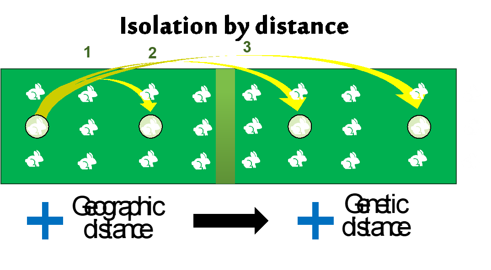

```{r setup, include=FALSE}
knitr::opts_chunk$set(
	echo = TRUE,
	message = FALSE,
	warning = FALSE,
	out.width = "50%"
)

#necessary to render tutorial correctly
library(learnr) 
library(htmltools)
#options(repos = BiocManager::repositories())
library(dartR.data)
library(dartR.base)
#gl.set.verbosity(2)

library(glDemo) # for tutorial data

```

## Introduction

*Why population structure matters*

{.class height="450"}

## Introduction

> -   What is a "population" in population genetics?

> -   Genetic structure defined -- how allele frequencies vary among groups.

> -   Key drivers: effective population size, gene flow/immigration, natural selection, drift.

> -   Isolation-by-distance & sampling design -- avoiding spurious structure.

> -   Why we care: management units, inbreeding, local adaptation, introgression.

## test

-   what

-   when

-   how

## Populations

{.class height="450"}

## Isolation by distance

IBD

{.class height="450"}

------------------------------------------------------------------------

```{r data1}
gl <- platypus.gl
pc <- gl.pcoa(platypus.gl, verbose = 0, plot.out = F)
```

```{r ex1, exercise=TRUE, exercise.setup = "data1"}

```

```{r ex1-solution}
gl <- testset.gl
class(gl)
```
